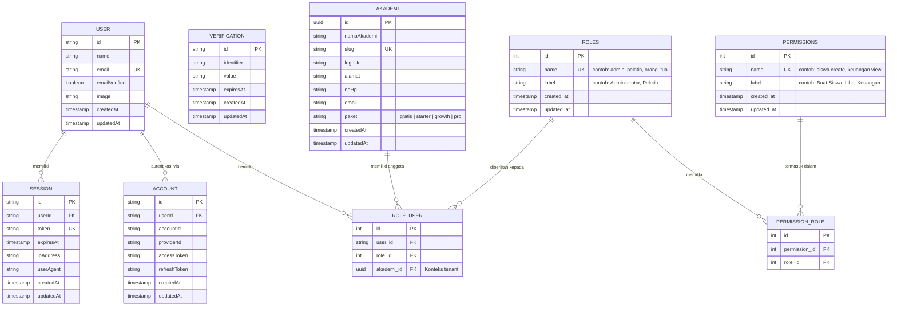

# 🔐 ERD & Pattern Autentikasi dan Hak Akses (Dynamic RBAC & Multi-Tenant)

Dokumen ini merangkum desain database dan _pattern_ implementasi sistem autentikasi serta kontrol akses pada SaaS Sport Management. Sistem ini menggunakan **Dynamic RBAC (Role-Based Access Control)** untuk manajemen hak akses yang fleksibel, dikombinasikan dengan **Multi-Tenant Isolation** di mana setiap akademi/SSB memiliki data yang terisolasi.

---

## 1. Konsep Peran & Hak Akses

### A. Multi-Tenant Architecture
Setiap **Akademi/SSB** adalah _tenant_ yang terisolasi datanya. Semua data (siswa, pelatih, jadwal, keuangan, dll.) dimiliki oleh satu akademi. Backend memastikan user hanya bisa mengakses data akademi miliknya.

### B. Dynamic RBAC (Akses Fitur/Sistem)
- **Roles**: Mengkategorikan level pengguna (contoh: `superadmin`, `admin`, `pelatih`, `orang_tua`).
- **Permissions**: Hak spesifik untuk melakukan suatu aksi (contoh: `siswa.create`, `siswa.delete`, `keuangan.view`, `evaluasi.manage`).
- **Penerapan**: Seorang _user_ bisa memiliki banyak _role_ (`role_user`), dan sebuah _role_ terdiri dari banyak _permission_ (`permission_role`). Pendekatan ini sangat dinamis; menambah hak akses baru tidak memerlukan perubahan kode keras (_hardcode_), cukup ditambahkan di database.

### C. Role Hierarchy

| Role | Akses | Platform |
|---|---|---|
| `superadmin` | Kelola semua akademi, monitoring asosiasi/PSSI | Web |
| `admin` | Kelola satu akademi (siswa, pelatih, keuangan, jadwal, dll.) | Web + Mobile |
| `pelatih` | Input absensi, evaluasi, materi latihan, lihat jadwal | Mobile + Web |
| `orang_tua` | Pantau anak (absensi, rapor, SPP, pengumuman) | Mobile |

---

## 2. Diagram ERD (Mermaid)

Skema berikut menggabungkan sistem akun Better Auth, sistem Dynamic RBAC, dan sistem Multi-Tenant Akademi.



---

## 3. Implementasi dengan Prisma & NestJS

### A. Prisma Schema (Contoh)

```prisma
model Akademi {
  id          String   @id @default(uuid())
  namaAkademi String
  slug        String   @unique
  logoUrl     String?
  alamat      String?
  noHp        String?
  email       String?
  paket       String   @default("gratis")
  createdAt   DateTime @default(now())
  updatedAt   DateTime @updatedAt

  users       RoleUser[]
  siswa       Siswa[]
  pelatih     Pelatih[]

  @@map("akademi")
}

model Role {
  id          Int               @id @default(autoincrement())
  name        String            @unique
  label       String?
  users       RoleUser[]
  permissions PermissionRole[]
  createdAt   DateTime          @default(now())
  updatedAt   DateTime          @updatedAt
}

model Permission {
  id        Int               @id @default(autoincrement())
  name      String            @unique
  label     String?
  roles     PermissionRole[]
  createdAt DateTime          @default(now())
  updatedAt DateTime          @updatedAt
}

model RoleUser {
  id        Int    @id @default(autoincrement())
  userId    String
  roleId    Int
  akademiId String

  user      User   @relation(fields: [userId], references: [id], onDelete: Cascade)
  role      Role   @relation(fields: [roleId], references: [id], onDelete: Cascade)
  akademi   Akademi @relation(fields: [akademiId], references: [id], onDelete: Cascade)

  @@unique([userId, roleId, akademiId])
}

model PermissionRole {
  id           Int        @id @default(autoincrement())
  permissionId Int
  roleId       Int
  permission   Permission @relation(fields: [permissionId], references: [id], onDelete: Cascade)
  role         Role       @relation(fields: [roleId], references: [id], onDelete: Cascade)

  @@unique([permissionId, roleId])
}
```

---

## 4. Matriks Akses Fitur

### A. Fitur Web Dashboard (Dynamic RBAC)

| Izin / Permission (`permissions.name`) | `superadmin` | `admin` | `pelatih` | `orang_tua` |
|---|:---:|:---:|:---:|:---:|
| `akademi.manage` (Kelola Akademi) | ✅ | ❌ | ❌ | ❌ |
| `siswa.create` (Tambah Siswa) | ✅ | ✅ | ❌ | ❌ |
| `siswa.view` (Lihat Data Siswa) | ✅ | ✅ | ✅ | ✅ (anak sendiri) |
| `siswa.delete` (Hapus Siswa) | ✅ | ✅ | ❌ | ❌ |
| `pelatih.manage` (Kelola Pelatih) | ✅ | ✅ | ❌ | ❌ |
| `jadwal.manage` (Kelola Jadwal) | ✅ | ✅ | ✅ | ❌ |
| `absensi.manage` (Input Absensi) | ✅ | ✅ | ✅ | ❌ |
| `keuangan.view` (Lihat Keuangan) | ✅ | ✅ | ❌ | ❌ |
| `keuangan.manage` (Kelola Keuangan) | ✅ | ✅ | ❌ | ❌ |
| `evaluasi.manage` (Input Evaluasi) | ✅ | ✅ | ✅ | ❌ |
| `evaluasi.view` (Lihat Raport) | ✅ | ✅ | ✅ | ✅ (anak sendiri) |
| `turnamen.manage` (Kelola Turnamen) | ✅ | ✅ | ❌ | ❌ |
| `pengumuman.manage` (Buat Pengumuman) | ✅ | ✅ | ❌ | ❌ |
| `pengumuman.view` (Lihat Pengumuman) | ✅ | ✅ | ✅ | ✅ |
| `user.manage` (Kelola User) | ✅ | ✅ | ❌ | ❌ |

### B. Custom Guard di NestJS (Permissions Checker)

```typescript
import { Injectable, CanActivate, ExecutionContext, ForbiddenException } from '@nestjs/common';
import { Reflector } from '@nestjs/core';
import { PrismaService } from '@/prisma/prisma.service';
import { auth } from '@/config/better-auth';

@Injectable()
export class PermissionsGuard implements CanActivate {
  constructor(private reflector: Reflector, private prisma: PrismaService) {}

  async canActivate(context: ExecutionContext): Promise<boolean> {
    const requiredPermissions = this.reflector.get<string[]>('permissions', context.getHandler());
    if (!requiredPermissions) return true;

    const request = context.switchToHttp().getRequest();

    // 1. Dapatkan userId dari Session Better Auth
    const session = await auth.api.getSession({ headers: request.headers });
    if (!session) throw new ForbiddenException('Belum login.');
    const userId = session.user.id;

    // 2. Dapatkan akademiId dari request context
    const akademiId = request.headers['x-akademi-id'] ?? request.user?.akademiId;
    if (!akademiId) throw new ForbiddenException('Konteks akademi tidak ditemukan.');

    // 3. Query ke database untuk mengecek permission user di akademi tersebut
    const userRoles = await this.prisma.roleUser.findMany({
      where: { userId, akademiId },
      include: {
        role: {
          include: { permissions: { include: { permission: true } } }
        }
      }
    });

    // 4. Kumpulkan semua array string permissions yang dimiliki user
    const userPermissions = userRoles.flatMap(ru =>
      ru.role.permissions.map(pr => pr.permission.name)
    );

    // 5. Validasi: Apakah user memiliki minimal satu permission yang dibutuhkan?
    const hasPermission = requiredPermissions.some(p => userPermissions.includes(p));
    if (!hasPermission) throw new ForbiddenException('Akses ditolak. Permission tidak mencukupi.');

    return true;
  }
}
```

### C. Tenant Guard (Multi-Tenant Isolation)

```typescript
import { Injectable, CanActivate, ExecutionContext, ForbiddenException } from '@nestjs/common';
import { PrismaService } from '@/prisma/prisma.service';

@Injectable()
export class TenantGuard implements CanActivate {
  constructor(private prisma: PrismaService) {}

  async canActivate(context: ExecutionContext): Promise<boolean> {
    const request = context.switchToHttp().getRequest();
    const userId = request.userId;
    const akademiId = request.headers['x-akademi-id'] ?? request.akademiId;

    if (!akademiId) {
      throw new ForbiddenException('Konteks akademi tidak ditemukan.');
    }

    // Verifikasi user memiliki akses ke akademi ini
    const membership = await this.prisma.roleUser.findFirst({
      where: { userId, akademiId },
    });

    if (!membership) {
      throw new ForbiddenException('Anda tidak memiliki akses ke akademi ini.');
    }

    request.akademiId = akademiId;
    return true;
  }
}
```

---

## 5. Frontend Pattern untuk Hak Akses (Next.js)

### A. Proteksi Halaman Admin (Middleware)

Melindungi route web khusus admin agar tidak bisa diakses oleh user biasa.

```typescript
// src/middleware.ts
import { NextRequest, NextResponse } from "next/server";
import { getSession } from "@/lib/auth-client";

export async function middleware(req: NextRequest) {
  const { data: session } = await getSession(req.headers);
  const path = req.nextUrl.pathname;

  // Proteksi rute admin utama
  if (path.startsWith("/admin")) {
    if (!session?.user) {
      return NextResponse.redirect(new URL("/login", req.url));
    }
  }

  // Proteksi rute superadmin
  if (path.startsWith("/superadmin")) {
    if (session?.user.role !== "superadmin") {
      return NextResponse.redirect(new URL("/unauthorized", req.url));
    }
  }

  return NextResponse.next();
}
```

### B. Validasi Multi-Tenant di Backend

Semua query yang melibatkan data akademi **wajib** menyertakan `akademiId` untuk isolasi data.

```typescript
// Contoh logika di NestJS Service
async findSiswaByAkademi(akademiId: string, currentUser: any) {
  // 1. Cek apakah user memiliki akses ke akademi ini
  const membership = await this.prisma.roleUser.findFirst({
    where: { userId: currentUser.id, akademiId },
  });

  if (!membership) {
    throw new ForbiddenException("Anda tidak memiliki akses ke akademi ini.");
  }

  // 2. Query siswa hanya untuk akademi tersebut
  return this.prisma.siswa.findMany({
    where: { akademiId },
    orderBy: { namaLengkap: 'asc' },
  });
}
```

### C. UI Wrapper Component (Permission Gate)

```typescript
// components/PermissionGate.tsx
"use client";
import { usePermissions } from "@/hooks/usePermissions";

interface PermissionGateProps {
  permission: string;
  children: React.ReactNode;
  fallback?: React.ReactNode;
}

export function PermissionGate({ permission, children, fallback }: PermissionGateProps) {
  const { hasPermission } = usePermissions();

  if (!hasPermission(permission)) {
    return fallback ?? null;
  }

  return <>{children}</>;
}

// Penggunaan:
<PermissionGate permission="siswa.create">
  <Button>Tambah Siswa</Button>
</PermissionGate>
```

---

## 6. Alur Multi-Akademi

1. **Admin** mendaftar dan membuat akademi baru → record di tabel `akademi`.
2. **Admin** mengundang pelatih/orang tua melalui link undangan.
3. Sistem membuat record di `role_user` dengan `akademi_id` yang sesuai.
4. Saat user login, frontend mendapatkan daftar akademi yang dimiliki/diikuti.
5. User memilih akademi → frontend mengirim `x-akademi-id` di setiap request.
6. Backend menggunakan `TenantGuard` untuk memastikan isolasi data.

---

*Dokumen ini merupakan pedoman baku implementasi sistem autentikasi dan multi-tenant pada SaaS Sport Management menggunakan Better Auth.*
